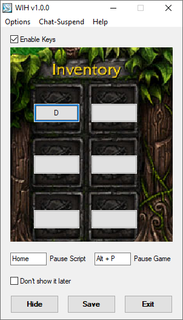

# WarCraft Inventory Hotkeys

This is cutted-down AucT Hotkeys Tool, a special edition for WarCraft III.

For compiling, use old autohotkey <https://autohotkey.com/board/topic/86134-autohotkey-10-classic-and-basic-versions/>

Removed most of the not needed stuff, so it includes only small number of functions.

## Functions

1. Inventory Hotkeys
2. Chat-free system (can be turned off) based on pixel compare.

## About chat-free system

This chat-free detection system is the same one used in AHT v2.1b. It will work in WarCraft III and check if you press enter to chat. It is not very reliable, but it should work if you only use enter for chatting.

Chat-free in lobby will check the color of the pixel in the top bar of WarCraft III to determine if you are in game or not. If you are in the lobby, the script will be off.

The chat-detection system is not as accurate as the previous one that read WarCraft III memory. But I could not make that work in patch 1.30.

You can use an indicator in the options menu to see if it is working as expected.

The advantage of this system is that it will work in any patch, but it is not as stable as reading WarCraft III memory. Have fun!

🇺🇦 #StandWithUkraine
